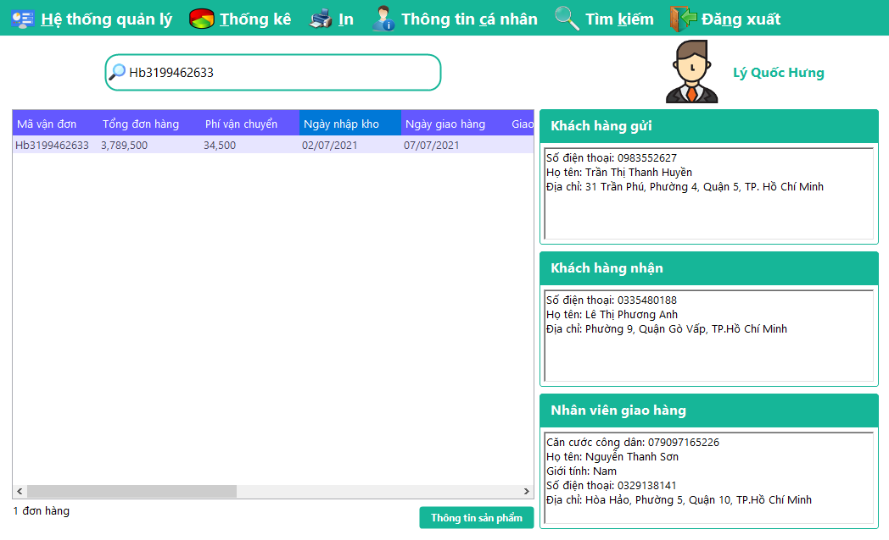
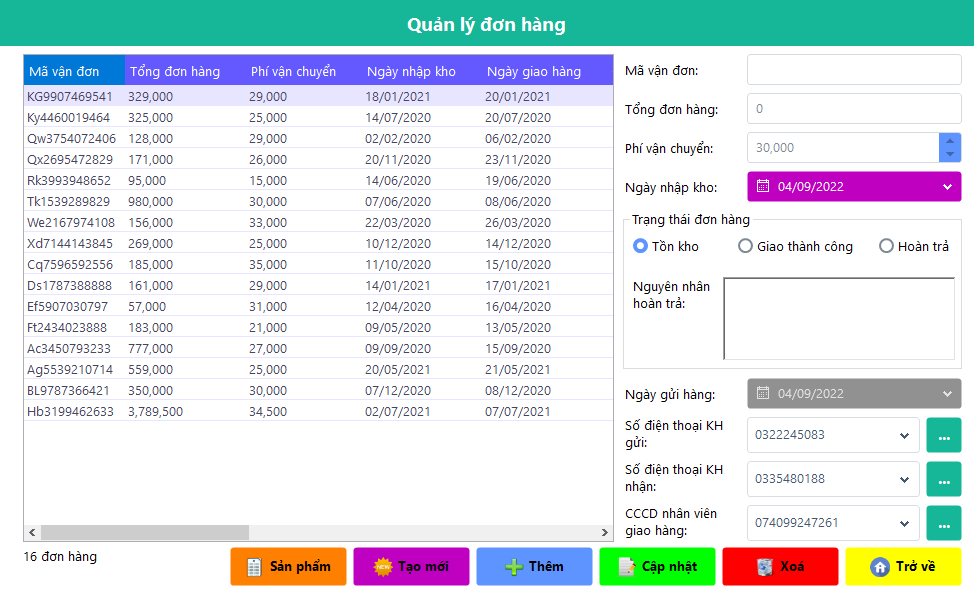
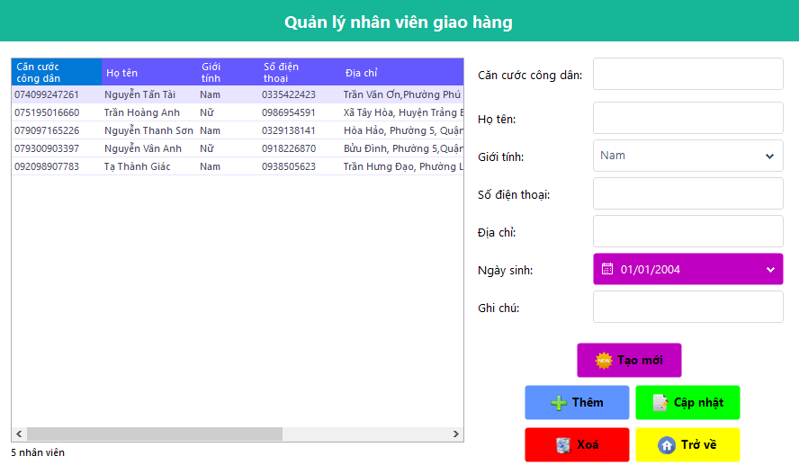
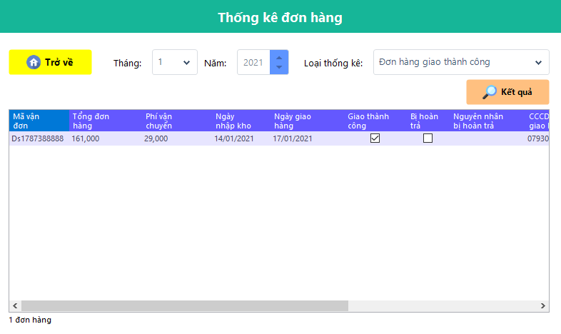
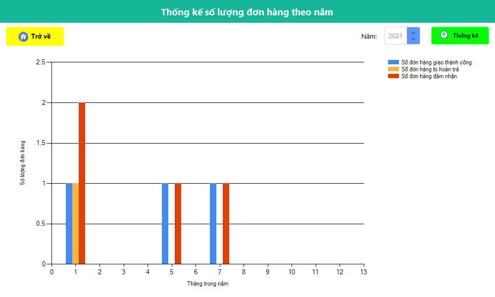

# Hệ thống quản lý dịch vụ giao hàng nhanh :articulated_lorry:

## :pushpin: Mô tả đề tài
Một công ty giao hàng nhanh cần quản lý các thông tin về đơn hàng và nhân viên giao hàng thuộc các chi nhánh của công ty, muốn xây dựng hệ thống quản lý giao hàng nhanh cho mỗi chi nhánh như sau:

Mỗi chi nhánh dịch vụ giao hàng nhanh sẽ có một người quản lý (Nhân viên quản lý), người này sẽ được cấp một tài khoản có quyền quản trị (Admin) để đăng nhập vào hệ thống nhằm thực thi các công việc quản lý về các đơn hàng và nhân viên giao hàng.

Nhân viên giao hàng cũng được cấp mỗi người một tài khoản nhưng chỉ có quyền xem các thông tin liên quan đến đơn hàng và khách hàng của nhân viên đó.

Mỗi tài khoản bao gồm các thông tin: Tên đăng nhập của nhân viên là duy nhất, tên hiển thị trên giao diện, mật khẩu để bảo mật tài khoản và quyền truy cập của nhân viên đó.

Nhân viên giao hàng khi vào làm, mỗi nhân viên giao hàng sẽ được quản lý lưu trữ thông tin cá nhân bao gồm: Căn cước công dân, họ tên, ngày sinh, giới tính, địa chỉ, số điện thoại, lương, ghi chú (nếu có).

Mỗi đơn hàng khi được nhận từ khách hàng gửi sẽ được lưu lại thông tin đơn hàng bao gồm: Mã vận đơn để phân biệt các đơn hàng với nhau, tổng giá trị của đơn hàng và phí vận chuyển, ngày nhập kho, ngày gửi, giao thành công, hoàn trả, nguyên nhân hoàn trả, căn cước công dân khách hàng gửi, căn cước công dân khách hàng nhận và căn cước công dân nhân viên phụ trách giao đơn hàng.

Trong thông tin sản phẩm của đơn hàng có chứa thông tin bao gồm: Mã sản phẩm, tên sản phẩm, số lượng sản phẩm, giá sản phẩm, thành tiền sản phẩm.

Mỗi khách hàng (gửi và nhận) khi sử dụng dịch vụ giao hàng nhanh lần đầu sẽ được lưu lại các thông tin bao gồm: Căn cước công dân, họ tên, số điện thoại, địa chỉ.

Mỗi đơn hàng khi được nhân viên quản lý nhận từ khách hàng gửi sẽ được nhân viên đó ghi nhận lại ngày gửi đơn hàng đó.
Khi nhân viên giao hàng giao cho khách hàng nhận sẽ ghi nhận lại trạng thái đơn hàng là thành công hay hoàn trả, và ghi nhận thêm ngày nhận hàng, nguyên nhân bị hoàn trả (nếu có).

## :framed_picture: Danh sách hình ảnh
- Đăng nhập

- Trang chủ

- Quản lý đơn hàng

- Quản lý khách hàng

- Quản lý nhân viên giao hàng

- Quản lý tài khoản

- Thống kế đơn hàng

- Thống kế doanh thu trong tháng

- Thống kế số lượng đơn hàng trong năm

- Hoá đơn
